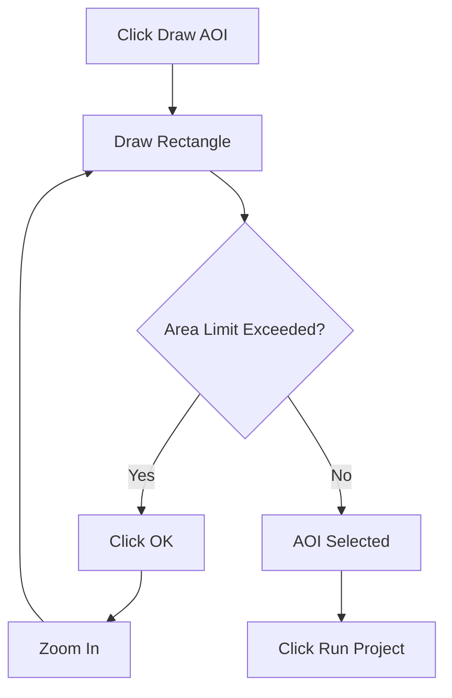
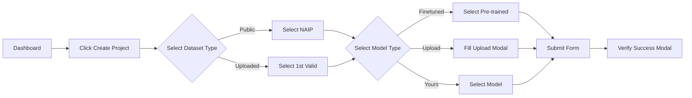
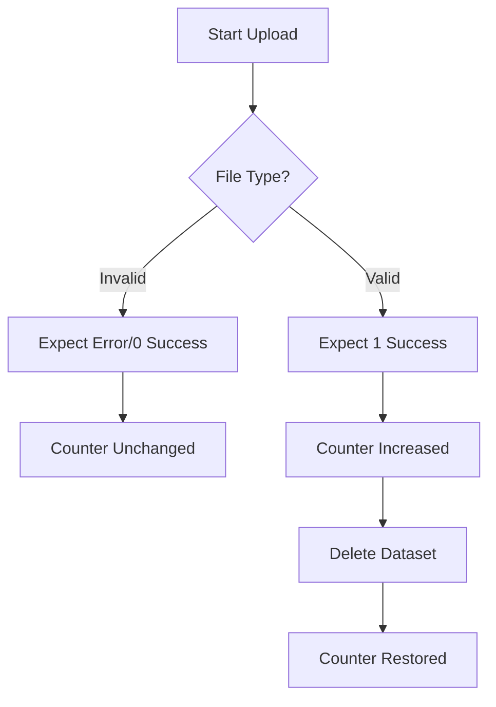

# 🗺️ GeoWGS84.AI Automation Test Suite

  

This repository contains the end-to-end automation test suite for the **GeoWGS84.AI** GIS platform. It covers critical user flows including navigation, project creation, dataset management, and model lifecycle.

---

## 📚 Table of Contents
1. [Test Architecture Overview](#test-architecture-overview)
2. [Test Suites Breakdown](#test-suites-breakdown)
   * [1. Sidebar Navigation](#1-sidebar-navigation-s_navbarspecjs)
   * [2. Upper Navbar](#2-upper-navbar-u_navbarspecjs)
   * [3. Create Project Form](#3-create-project-form-create_gisspecjs)
   * [4. Project Lifecycle](#4-project-lifecycle-projectsspecjs)
   * [5. Dashboard Validation](#5-dashboard-validation-dashboardspecjs)
   * [6. Dataset Management](#6-dataset-management-datasetsspecjs)
   * [7. GIS Upload Validation](#7-gis-upload-validation-upload_gisspecjs)
3. [Key Logic & Selection Strategies](#key-logic--selection-strategies)
4. [Visual Flow Diagrams](#visual-flow-diagrams)

---

## 🏗️ Test Architecture Overview

The suite follows the **Page Object Model (POM)** design pattern to ensure maintainability and reusability.
- **Pages:** `SidebarPage`, `UpperNavbarPage`, `CreateProjectPage`, `ProjectsPage`, `DashboardPage`, etc.
- **Helpers:** Centralized utilities for logging, highlighting, and robust clicking.
- **Diagnostics:** Automatic screenshot/video capture on failure.

---

## 🧪 Test Suites Breakdown

### 1. Sidebar Navigation (`s_navbar.spec.js`)

Tests the visibility and navigation functionality of the left-hand sidebar.

#### **TC-1: Sidebar Elements are Visible**
1.  **Setup:** Navigates to `/#/dashboard`.
2.  **Selection:** Defines 14 core locators (Logo, Dashboard, Datasets, Projects, Fine Tuned Models, Annotate, etc.).
3.  **Loop Logic:** Iterates through each locator.
    *   **Action:** Highlights the element.
    *   **Check:** `isVisible()` check.
    *   **Data Extraction:** Extracts `innerText` if available.
    *   **Condition:** Catches errors if an element is missing and logs a warning instead of failing immediately (soft assertion).
4.  **Assertion:** Strict `expect(locator).toBeVisible()` for every item in the list.

#### **TC-2: Verify Sidebar Elements**
1.  **Step 1 (Logo):**
    *   **Action:** Clicks Logo.
    *   **Logic:** Listens for `context.waitForEvent('page')`.
    *   **Condition:** If a new tab opens:
        *   Checks if URL contains `geowgs84.ai`.
        *   Waits 2.5 seconds.
        *   Closes the tab.
    *   **Fallback:** If no new tab, assumes same-window navigation.
2.  **Step 2 (Dashboard):**
    *   **Action:** Clicks "Dashboard" link.
    *   **Assertion:** Checks if the link has the CSS class `active`.
3.  **Step 3 (Datasets Dropdown):**
    *   **Action:** Clicks "Datasets" toggle.
    *   **Sub-flow:** Iterates through "Public Dataset", "Uploaded Datasets", "Purchased Datasets".
        *   **Action:** Clicks sub-item.
        *   **Verification:** Waits for URL change.
        *   **Action:** Clicks "Datasets" toggle again to reset state.
4.  **Step 4-9 (Standard Navigation):**
    *   **Items:** Projects, Fine Tuned Models, Annotate, Training Datasets, Your Models, Download GIS Analysis.
    *   **Action:** Clicks link.
    *   **Logic:** Waits for `networkidle` or URL change.
    *   **Verification:** Logs navigation success.
5.  **Step 10-14 (External Links):**
    *   **Items:** Documentations, Discussion, Discord, Utilities, Privacy Policy.
    *   **Action:** Clicks link.
    *   **Logic:** Expects `context.waitForEvent('page')` (New Tab).
    *   **Verification:** Checks new tab URL for specific parts (e.g., `/documentation`).
    *   **Cleanup:** Closes new tab and focuses the original window.

---

### 2. Upper Navbar (`u_navbar.spec.js`)

Tests the top navigation bar, toggles, and user settings.

#### **Click and View Upper Navbar**
1.  **Step 2 (Sidebar Toggle):**
    *   **Selection:** `button.header-toggler`.
    *   **Action:** Click.
    *   **Logic:** Captures `boundingBox()` of sidebar before and after click.
    *   **Condition:** `expect(before).not.toEqual(after)` (Verifies width changed).
2.  **Step 3 (Dashboard):**
    *   **Selection:** Link with text "Dashboard".
    *   **Action:** Click.
    *   **Assertion:** Expects link to have class `active`.
3.  **Step 4 (Users):**
    *   **Selection:** Link with text "Users".
    *   **Action:** Click.
    *   **Assertion:** Expects "Users" link to have class `active` and "Dashboard" to lose it.
4.  **Step 5 (Enhancement Request):**
    *   **Selection:** Specific `.nav-link` with `href` containing `enhancement-request-new`.
    *   **Logic:** Clicks link -> Waits for new tab.
    *   **Assertion:** URL must match exactly `https://www.geowgs84.ai/enhancement-request-new?page=dashboard`.
    *   **Cleanup:** Closes tab.
5.  **Step 6-7 (Billing & Updates):**
    *   **Action:** Clicks links.
    *   **Verification:** Checks URL changes to `#/billingservices` and `#/updates`.
6.  **Step 8 (Color Modes):**
    *   **Selection:** SVG icon (index 18).
    *   **Action:** Click to open dropdown.
    *   **Flow:** Clicks "Light" -> Clicks "Dark" -> Clicks "Auto".
    *   **Logic:** Removes tooltips obstructing clicks.
7.  **Step 9 (User Dropdown):**
    *   **Selection:** Avatar image (`.avatar-img`).
    *   **Action:** Click to open menu.
    *   **Flow:**
        *   Clicks "Updates" -> Verifies URL.
        *   Re-opens dropdown.
        *   Clicks "Profile" -> Verifies URL.
        *   Re-opens dropdown.
        *   Clicks "Payments" -> Verifies URL.
    *   **Error Handling:** If dropdown fails to open, reloads dashboard page and retries.
8.  **Step 10 (Delete Profile):**
    *   **Action:** Opens dropdown -> Clicks "Delete Profile".
    *   **Verification:** Checks for `.modal-dialog` appearance.
9.  **Step 11 (Logout):**
    *   **Action:** Clicks "Cancel" on delete modal.
    *   **Action:** Opens dropdown -> Clicks "Logout".

---

### 3. Create Project Form (`create_gis.spec.js`)

Inspects dynamic form behavior and validates project creation inputs.

#### **TC-1: Inspect Dynamic Sub-fields**
*   **Project Name:** No name is entered (Test stops before submission).
*   **Data Type:**
    *   **Selection:** Selects the **first valid option** (skips placeholders like "-- Select --").
    *   **Logic:** Iterates through options to find one that doesn't contain "select".
*   **Dataset Category:**
    *   **Selection:** Iterates through **"Public Dataset"** and **"Uploaded Dataset"**.
*   **Sub-Dataset (Dependent):**
    *   **If Public:** Waits for dropdown -> Selects **"NAIP (6 inches / 1 meter m)"**.
    *   **If Uploaded:** Waits for dropdown -> Selects the **first valid dataset** found in the list (skipping "Upload new").
    *   **Check:** Logs the count of available options.
*   **Model Type:**
    *   **Selection:** **"Finetuned Public Model"**.
*   **Pre-trained Model (Dependent):**
    *   **Logic:** Waits for the Pre-trained dropdown to appear.
    *   **Dynamic Check:** Changes Analysis Type to **"Segmentation"**, then **"Classification"**, then back to **"Object Detection"**.
    *   **Verification:** Asserts that the Pre-trained Model list updates (changes content) based on the Analysis Type selected.
*   **Other Model Types:**
    *   **Create New Model:** Selects it -> Verifies **no popup** appears.
    *   **Upload Model:** Selects it -> Verifies **Upload Modal appears** -> Closes modal.
    *   **Your Created Model:** Selects it -> Verifies **"Your Models" dropdown appears** -> Selects first model.

#### **TC-2: Create Finetuned Project using Public Dataset**
*   **Project Name:** Writes `FinetunedModel-${timestamp}` (e.g., *FinetunedModel-170123456789*).
*   **Data Type:** Selects **first valid option**.
*   **Dataset Category:** Selects **"Public Dataset"**.
*   **Sub-Dataset:** Selects **"NAIP (6 inches / 1 meter m)"**.
*   **Analysis Type:** Selects **"Object Detection"**.
*   **Model Type:** Selects **"Finetuned Public Model"**.
*   **Pre-trained Model:** Selects the **first valid model** from the list.
*   **Submission:** Clicks "Create Project" button.
*   **Post-Submission Check:**
    *   Verifies "Success" modal appears.
    *   Clicks "OK" on modal.
    *   Navigates to Dashboard to check if "Create Project" count increased by 1.
    *   Navigates to Projects page to find the card.

#### **TC-3: Create Finetuned Project using Uploaded Dataset**
*   **Project Name:** Writes `FinetunedModel-${timestamp}`.
*   **Data Type:** Selects **first valid option**.
*   **Dataset Category:** Selects **"Uploaded Dataset"**.
*   **Sub-Dataset:**
    *   **Check:** Verifies there are datasets available.
    *   **Selection:** Selects the **first valid uploaded dataset**.
*   **Analysis Type:** Selects **"Object Detection"**.
*   **Model Type:** Selects **"Finetuned Public Model"**.
*   **Pre-trained Model:** Selects **first valid model**.
*   **Submission:** Submits form -> Verifies success -> Deletes project.

#### **TC-4: Create Create New Model Project**
*   **Project Name:** Writes `CreateNewModel-${timestamp}`.
*   **Dataset Category:** Selects **"Public Dataset"**.
*   **Sub-Dataset:** Selects **"NAIP (6 inches...)"**.
*   **Analysis Type:** Selects **"Object Detection"**.
*   **Model Type:** Selects **"Create New Model"**.
*   **Submission:** Submits form.
*   **Verification:** Checks project exists in "Create New Model" section. (No "Run" step usually).

#### **TC-5: Create Upload Model Project**
*   **Project Name:** Writes `UploadModelProject-${timestamp}`.
*   **Dataset Category:** Selects **"Uploaded Dataset"**.
*   **Sub-Dataset:** Selects **first valid dataset**.
*   **Analysis Type:** Selects **"Object Detection"**.
*   **Model Type:** Selects **"Upload Model"**.
*   **Upload Modal Logic:**
    *   **Action:** Waits for Modal to appear.
    *   **File:** Sets input file to `utils/testdata/Uploadmodel.pth`.
    *   **Model Name Input:** Writes `UploadModel-${timestamp}`.
    *   **Description:** Writes "Uploaded by automation test".
    *   **Min Resolution:** Writes "7".
    *   **Max Resolution:** Writes "80".
    *   **Action:** Clicks "Upload" inside modal.
    *   **Verification:** Waits for "Upload Success" modal.
*   **Submission:** Submits main form -> Verifies success.

#### **TC-6: Create Your Created Model Project**
*   **Project Name:** Writes `YourModelProject-${timestamp}`.
*   **Dataset Category:** Selects **"Public Dataset"**.
*   **Sub-Dataset:** Selects **"NAIP (6 inches...)"**.
*   **Analysis Type:** Selects **"Object Detection"**.
*   **Model Type:** Selects **"Your Created Model"**.
*   **Model Selection:**
    *   **Check:** Verifies "Your Models" dropdown is populated.
    *   **Selection:** Selects **first valid model** from the list.
*   **Submission:** Submits form -> Verifies success.

---

### 4. Project Lifecycle (`projects.spec.js`)

Tests the full lifecycle: **Create -> Run -> Delete**.

#### **TC-1: Projects page layout and dynamic content validation**
*   **No form filling.**
*   **Verification:**
    *   Checks visibility of 4 section headers: "Finetuned Public Model", "Create New Model", "Upload Model", "Your Created Model".
    *   Loops through cards in each section and logs the count.

#### **TC-2: Create project using Public Dataset (Finetuned Public Model)**
*   **Project Name:** `FinetunedModel-${timestamp}`.
*   **Inputs:** Same as TC-2 in `create_gis.spec.js` (Public/NAIP/Finetuned/First Pre-trained).
*   **Post-Create Verification:**
    *   Finds the card.
    *   **Check:** Validates card text contains "NAIP" and "Finetuned Public Model".
*   **Run Flow:**
    *   Clicks "Run" button.
    *   **Map Logic:** Waits for Leaflet map.
    *   **AOI (Area of Interest) Logic:**
        *   Clicks "Draw AOI" button.
        *   Draws a rectangle on the map canvas.
        *   **Condition:** Checks for "Area Limit Exceeded" popup.
        *   **Recovery:** If limit exceeded -> Clicks OK -> Zooms In -> Redraws rectangle.
    *   **Run Execution:** Clicks "Run Project" -> Waits for completion modal -> Clicks OK.
*   **Cleanup:** Deletes project.

#### **TC-3: Create project using Uploaded Dataset (Create New Model)**
*   **Project Name:** `CreateNewModel-${timestamp}`.
*   **Inputs:** Uploaded Dataset (first valid) + Create New Model type.
*   **Verification:** Checks card exists in "Create New Model" section.
*   **Cleanup:** Deletes project.

#### **TC-4: Create project using Upload Model**
*   **Project Name:** `UploadModel-${timestamp}`.
*   **Inputs:** Uploaded Dataset + Upload Model (fills modal with file, name, desc, res 7-80).
*   **Run Flow:**
    *   **AOI Logic:** Draws rectangle.
    *   **Condition:** Specifically for uploaded datasets, might handle different zoom levels or limit checks.
    *   Runs project.
*   **Cleanup:** Deletes project.

#### **TC-5: Create project using Your Created Model**
*   **Project Name:** `YourModelProject-${timestamp}`.
*   **Inputs:** Public Dataset (NAIP) + Your Created Model (first valid).
*   **Run Flow:** Draws AOI -> Handles Area Limit -> Runs.
*   **Cleanup:** Deletes project.

---

### 5. Dashboard Validation (`dashboard.spec.js`)

*   **TC-1 (Cards):**
    *   **Verification:** Loops through list: "Upload GIS Data", "Create GIS Project", "Purchase GIS Data", "Download GIS Analysis".
    *   **Assertion:** `expect(locator).toBeVisible()`.
*   **TC-2 (Usage):**
    *   **Verification:** Checks "Storage Usage" and "GPU Credit Usage" containers.
    *   **Logic:** Verifies `canvas` element inside GPU card exists.
*   **TC-3 (System Status):**
    *   **Verification:** Checks "All systems Up", "Uptime 90 Days", "Overall Uptime", "Status updates".
*   **TC-4 (Social Cards):**
    *   **Logic:** Iterates through social columns.
    *   **Action:** Clicks link.
    *   **Condition:** Handles new tab -> Verifies URL -> Closes tab.
*   **TC-5 (Fine-Tuned Models):**
    *   **Logic:** Iterates table rows.
    *   **Action:** Clicks "View Description".
    *   **Condition:** Handles new tab -> Closes tab.

---

### 6. Dataset Management (`datasets.spec.js`)

#### **TC-DATASET-01: Public Dataset**
1.  **Setup:** Dashboard -> Datasets Menu -> Public Dataset.
2.  **Logic:** Loops through table rows (`processTableRows`).
3.  **Action:**
    *   Clicks dataset name cell.
    *   **Condition:** Checks for "View WMS" link -> Opens New Tab -> Closes.
    *   **Condition:** Checks for "View WCS" link -> Opens New Tab -> Closes.
    *   **Condition:** Checks for "View Detail" link -> Opens New Tab -> Closes.

#### **TC-DATASET-02: Uploaded Datasets**
1.  **Setup:** Dashboard -> Datasets Menu -> Uploaded Datasets.
2.  **Logic:** Loops through table rows.
3.  **Action:**
    *   Clicks name cell.
    *   Checks button in "Action" column.
    *   **Condition:** If text is "Publish":
        *   Clicks Publish.
        *   Waits for button to change to "View".
    *   **Condition:** If text is "View":
        *   Clicks View -> Verifies Canvas modal -> Closes.
    *   **Action:** Clicks WMS -> Verifies modal -> Closes.
    *   **Action:** Clicks WCS -> Verifies modal -> Closes.
    *   **Delete Logic:** Clicks Delete -> Expects "Confirm Delete" popup -> Clicks "Cancel" -> Verifies row still exists.

#### **TC-DATASET-03: Purchased Datasets**
1.  **Setup:** Dashboard -> Datasets Menu -> Purchased Datasets.
2.  **Verification:** Checks for text "No non-premium datasets available".
3.  **Action:** Clicks "Purchase New Dataset".
4.  **Verification:** Checks URL is `#/PurchaseGISData`.
5.  **Action:** Clicks "Purchase Data" -> Handles New Tab -> Closes.
6.  **Action:** Clicks "Purchased Data" -> Verifies "No purchased data available" alert.

---

### 7. GIS Upload Validation (`upload_gis.spec.js`)

#### **Negative Tests (TC-1, 2, 3)**
1.  **Setup:** Dashboard -> Capture "Upload GIS Data" counter (Initial Count).
2.  **Action:** Open Upload Page.
3.  **Selection:**
    *   TC-1: Invalid File (`T1.png`).
    *   TC-2: Invalid Folder (`T1` folder).
    *   TC-3: Invalid Zip (`T1.zip`).
4.  **Logic:**
    *   Uploads file/folder.
    *   Submits form.
    *   **Condition:**
        *   If Error Popup: Verify text -> Close.
        *   If Summary Modal: Verify "Successful Uploads: 0, Failed Uploads: 1" -> Close.
5.  **Verification:** Return to Dashboard -> **Assert Counter == Initial Count**.

#### **Positive Tests (TC-4, 5, 6)**
1.  **Setup:** Dashboard -> Capture "Upload GIS Data" counter (Initial Count).
2.  **Action:** Open Upload Page.
3.  **Selection:**
    *   TC-4: Valid File (`T2.sid`).
    *   TC-5: Valid Folder (`T2` folder).
    *   TC-6: Valid Zip (`T2.zip`).
4.  **Logic:**
    *   Uploads file/folder.
    *   Enters Dataset Name (`UploadGISData-${timestamp}`).
    *   Submits form.
    *   **Condition:** Handles Summary Modal (Successful: 1, Failed: 0).
    *   **Verification:** Checks table for new row with matching name.
    *   **Publish Flow:** Clicks "Publish" -> Waits for "View".
    *   **View Flow:** Clicks "View" -> Verifies Canvas -> Closes.
    *   **WMS/WCS:** Clicks buttons -> Verifies modals.
5.  **Verification:** Return to Dashboard -> **Assert Counter == Initial Count + 1**.
6.  **Cleanup:** Open Upload Page -> Click Delete on specific row -> Handle Confirmation Popup -> Verify Deletion.
7.  **Final Verification:** Return to Dashboard -> **Assert Counter == Initial Count**.

---

## 🧠 Key Logic & Selection Strategies

### 1. Dynamic Data Selection
*   **Project Name:** Always generated dynamically using `Date.now()` to ensure uniqueness (e.g., `Project-170123456789`).
*   **Dropdowns:** Uses a "clean options" helper to skip placeholders ("-- Select --", "Upload new") and selects the **first valid enabled option**.

### 2. AOI Drawing Resilience
The test suite handles map interactions robustly:


### 3. Tab Handling
*   **Internal Links:** Waits for URL change or `networkidle`.
*   **External Links:** Uses `Promise.all` to wait for `context.waitForEvent('page')` simultaneously with the click action to catch new tabs instantly.

---

## 📊 Visual Flow Diagrams

### Project Creation Flow



### Upload GIS Validation Flow



---

## 🛠️ Setup & Execution

### Prerequisites
*   Node.js (v18+)
*   Playwright

### Installation
```bash
npm install
npx playwright install
```

### Running Tests
```bash
# Run all tests
npx playwright test

# Run specific suite
npx playwright test tests/create_gis.spec.js

# Run in UI Mode
npx playwright test --ui
```
